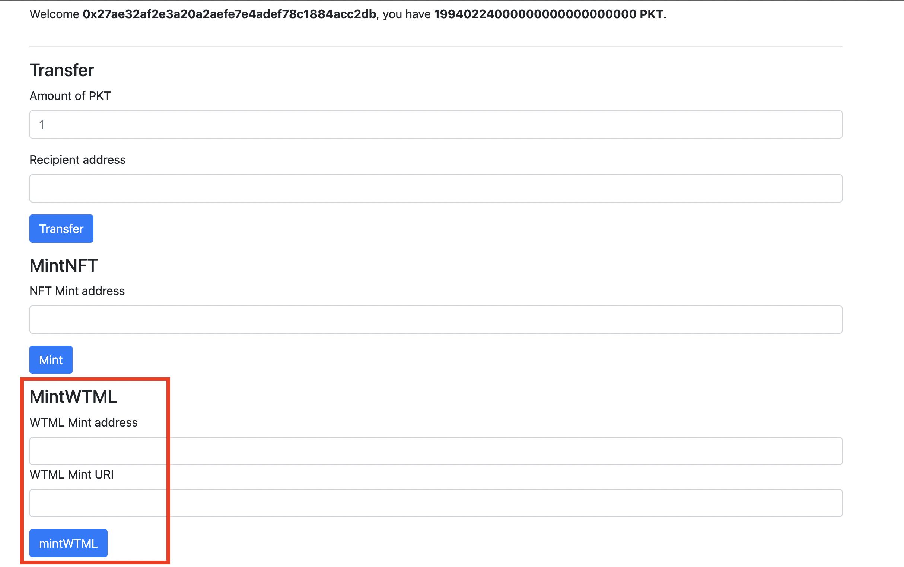
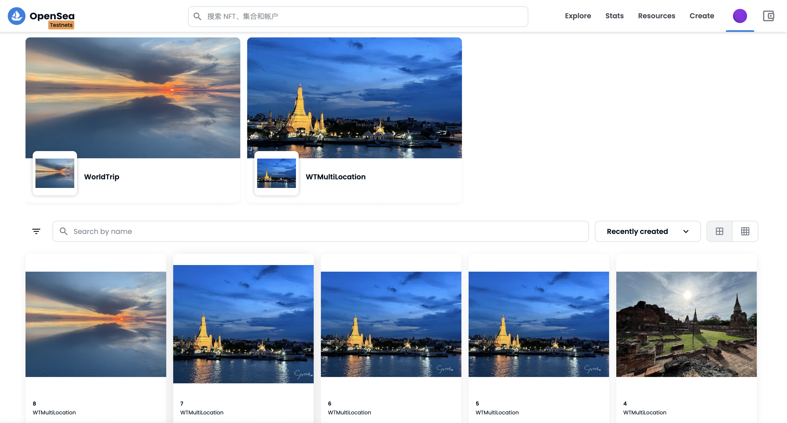

# Add functions to the NFT contract
# 一張合約發出有不同的照片和屬性（讓一張合約裡面有不同照片的選項）

參考資料：
1. [PecuLab共學Youtube](https://youtu.be/rSJwzWvAivI)
2. [PecuLab Github](https://github.com/pecu/PecuLab4SEP)


## Steps
把新的合約加入Dapp，可以分成下面幾個大步驟
1. 合約
2. 建立mint.js檔案
3. 將合約和mint.js加入Dapp.js
製作NFT的過程參考[CreateNFT](CreateNFT.md)~
### 1. 建立和deploy新合約
* `npx hardhat clean`可以把artifacts(compile後自動產生的)清除
* 不要忘記建立[deploy](hardhat/scripts/deploy_WTML.js)檔案才能deploy喔！
* 將commit完的artifacts/contracts/WTMultiLocation.sol/WTMultiLocation.json放到hardhat/frontend/src/contract中，這樣等一下Dapp.js才能提取合約的abi
* 將不同的照片及屬性傳入合約，所以比起前面的NFT合約，要建立傳入tokenURI的function，詳細說明如下
```javascript
pragma solidity ^0.8.4;
import "@openzeppelin/contracts/token/ERC721/ERC721.sol";
import "@openzeppelin/contracts/access/Ownable.sol";
import "@openzeppelin/contracts/utils/Counters.sol";

contract WTMultiLocation is ERC721 {
    using Counters for Counters.Counter;

    //建立tokenCounter，讓和約可以自己更新tokenID
    //這邊用openzeppelin預設的也可以
    uint256 public tokenCounter;
    //讓tokenURI可以從外部傳入
    mapping (uint256 => string) private _tokenURIs;
    constructor() ERC721("WTMultiLocation", "WTML") { tokenCounter = 1; }

    // mint function 傳入to:要空投的錢包address和我們想要指定的tokenURI(ipfs上的json檔)
   function mint(address to, string memory _tokenURI) public {
        _safeMint(to, tokenCounter);
        _setTokenURI(tokenCounter, _tokenURI);
        // mint後把tokenID+1
        tokenCounter++;
    }

    // 這邊是設定每個URL建立一個array，去把不同URI各自收起來
    function _setTokenURI(uint256 _tokenId, string memory _tokenURI) internal virtual {
        require(
            _exists(_tokenId),
            "ERC721Metadata: URI set of nonexistent token"
        );  // Checks if the tokenId exists
        _tokenURIs[_tokenId] = _tokenURI;
    }
    
    // 從外部傳入tokenURL呼叫這個function
    function tokenURI(uint256 _tokenId) public view virtual override returns(string memory) {
        require(
            _exists(_tokenId),
            "ERC721Metadata: URI set of nonexistent token"
        );
        return _tokenURIs[_tokenId];
    }  
}

```
### 2. 建立mint.js檔案
```javascript
import React from "react";

export function MintWTML({ mintWTML }) { 
  // 建立mintNFT這個function，把在前端的入的to傳到Dapp.js中
  return (
    <div>
      <h4>MintWTML</h4> 
      <form
        onSubmit={(event) => {
          // This function just calls the transferTokens callback with the
          // form's data.
          event.preventDefault();

          const formData = new FormData(event.target);
          const to = formData.get("to");
          const tokenURI = formData.get("tokenURI");

          // 要傳入合約的兩個參數寫在這邊，再利用這個function和Dapp.js做互動
          if (to && tokenURI) {
            mintWTML(to, tokenURI);
          }
        }}
      >
        <div className="form-group">
          <label>WTML Mint address</label>
          <input className="form-control" type="text" name="to" required />
          <label>WTML Mint URI</label>
          <input className="form-control" type="text" name="tokenURI" required />
        </div>
        <div className="form-group">
          <input className="btn btn-primary" type="submit" value="mintWTML" />
        </div>
      </form>
    </div>
  );
}
```
### 3. 將合約和mint.js加入Dapp.js
1. import新合約產生的json檔和剛剛寫的mint檔案
```javascript
import WTMLnft from "../contract/WTMultiLocation.json";
import { MintWTML } from "./MintWTML";
```
2. initialize WTMultiLocation artifact
```javascript
async _initializeEthers() {
    // We first initialize ethers by creating a provider using window.ethereum
    this._provider = new ethers.providers.Web3Provider(window.ethereum);

    // Then, we initialize the contract using that provider and the token's
    // artifact. You can do this same thing with your contracts.
    this._token = new ethers.Contract(
      contract_address.PokenTest,
      PokenCoin.abi,
      this._provider.getSigner(0)
    );
    //  initialize the NFT artifact
    this._nft = new ethers.Contract(
      contract_address.WorldTrip,
      WTnft.abi,
      this._provider.getSigner(0)
    );
    // initialize  WTMultiLocation artifact
    this._nft = new ethers.Contract(
      contract_address.WorldTripMulti,
      WTMLnft.abi,
      this._provider.getSigner(0)
    );
}
```
3. 建立在Dapp中把參數傳到合約中的function
```javascript
async _minWTML(to, tokenURI){
    try {      
      this._dismissTransactionError();
      //調用合約裡面的mint function
      const tx = await this._WTML.mint(to, tokenURI);     
      const receipt = await tx.wait();
      if (receipt.status === 0) {
        throw new Error("Mint WTML failed");
      }
    } catch (error) {
      if (error.code === ERROR_CODE_TX_REJECTED_BY_USER) {
        return;
      }
  
      console.error(error);
      this.setState({ transactionError: error });
    } finally {
      this.setState({ txBeingSent: undefined });
    }
  }
```
4. 把在前端收到的參數(to, tokenURI)傳到剛剛寫的async _minWTML function中，然後讓async _minWTML function去跟合約做互動
```javascript
{
  <MintWTML
    mintWTML={(to, tokenURI) =>
      this._mintWTML(to, tokenURI)
    }
  />
}
```
### cd hardhat/frontend & `npm start`

透過我們做的Dapp將不同NFT傳給自己的錢包，在[opensea test](https://testnets.opensea.io/zh-CN)中可以看到，同一份合約可以有不同的NFT

上面可以看到，最後一張用上次的合約發行的NFT，前面兩張是用這一份合約發行的，tokenID有連續、token名稱相同，呈現不同的NFT，下面是create總攬的截圖～


> 筆記寫道這邊突然好有成就感，真想把所有旅遊的照片通通發成NFT讓大家看到哈哈  
> 希望疫情趕快結束這樣我就可以繼續我龜速的環遊世界行程ＸＤ

Back to [README](README.md)