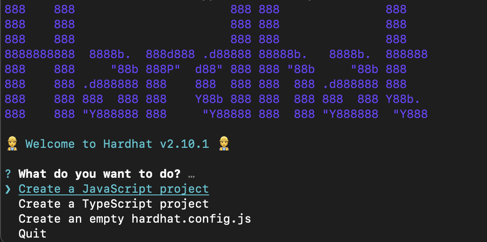
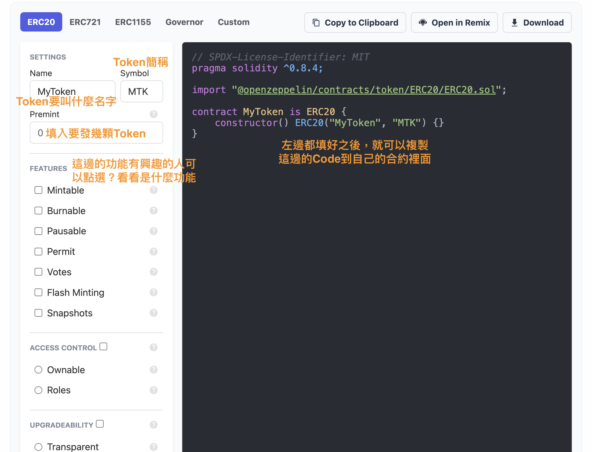
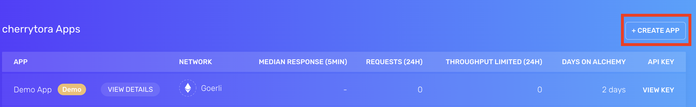
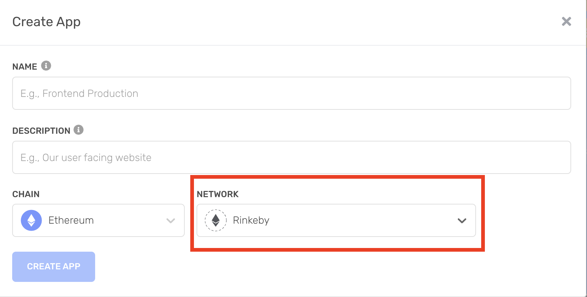
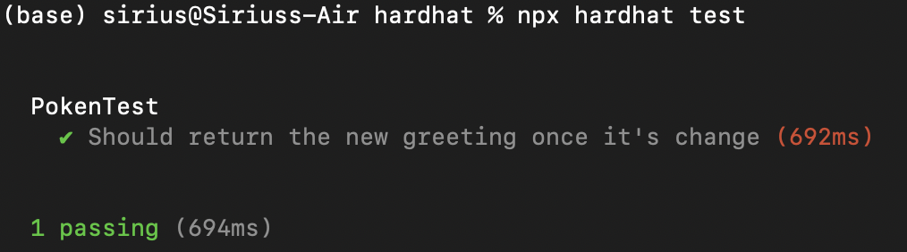
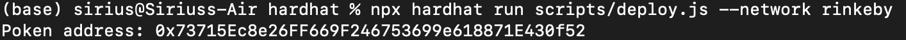
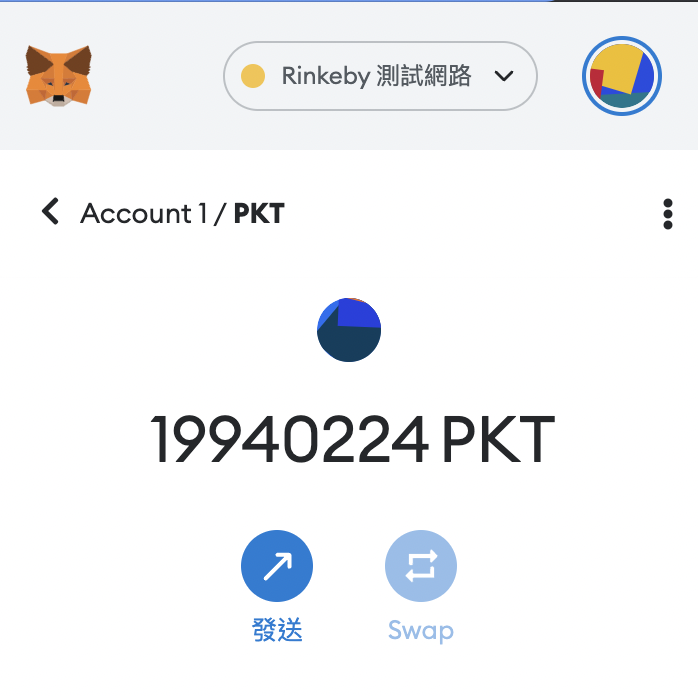
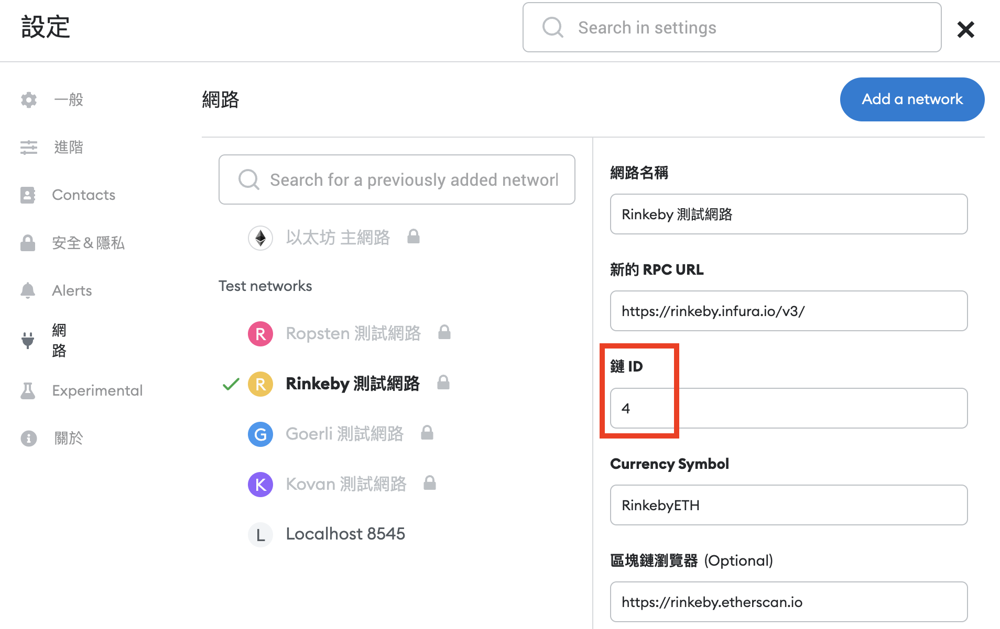
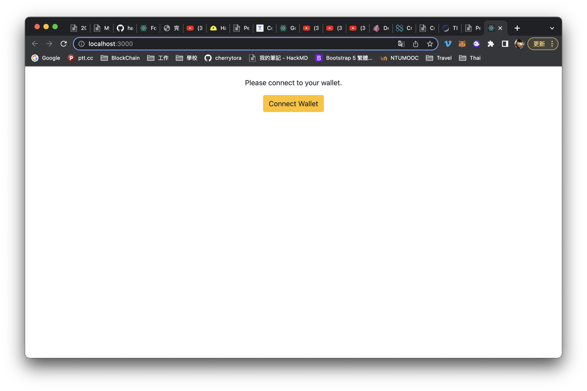
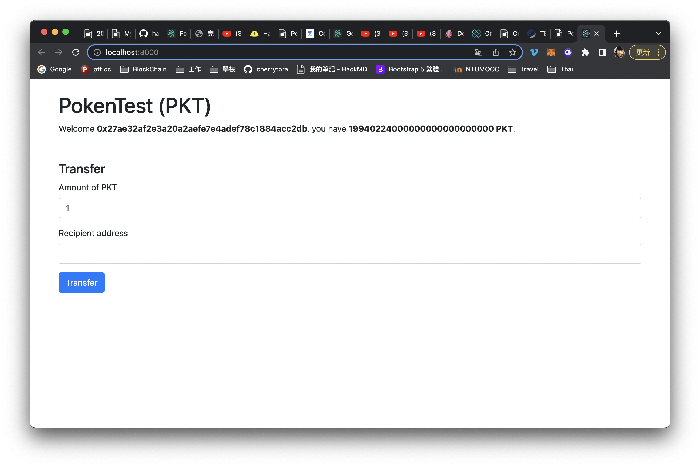

# Create my token

參考資料：
1. [hardhat tutorial](https://hardhat.org/tutorial)
2. [完整的Hardhat實踐教程](https://medium.com/my-blockchain-development-daily-journey/%E5%AE%8C%E6%95%B4%E7%9A%84hardhat%E5%AF%A6%E8%B8%90%E6%95%99%E7%A8%8B-a9b005aa4c12)
3. [PecuLab共學Youtube](https://youtu.be/0rlY6WUtrAY)
4. [PecuLab Github](https://github.com/pecu/PecuLab4SEP)
5. [React tutorial](https://create-react-app.dev/docs/getting-started)
6. [boilerplate repo](https://github.com/NomicFoundation/hardhat-boilerplate)

* 小提醒1：Rinkeby測試鏈2022/10/05就不支援了，建議測試換到Goerli測試鏈。我懶得領測試幣，所以在還有一些餘額的Rinkeby上測試XD
* 小提醒2：Hardhat的[boilerplate repo](https://github.com/NomicFoundation/hardhat-boilerplate)可以直接RUN起一個DApp，但是我想要建立自己的Token，所以沒有全部都用他的repo，只截取了一部分，懶惰的人可以直接去看boilerplate repo就好了～

## Steps
### Hardhat前置作業
1. `npm install --save -dev hardhat`
2. `npx hardhat` 

後面會用React來建立DApp，所以這邊選第一個。
3. `npm install @openzeppelin/contracts`
這可選擇要不要裝，這是用openzeppelin來產生合約的套件，合約也可以用hardhat提供的範本或自己寫

### 建立自己的 Token
1. 利用[openzeppelin](https://docs.openzeppelin.com/contracts/4.x/wizard)建立自己的Token

2. openzeppelin都填好了之後也可以直接下載[檔案](hardhat/contracts/PokenTest.sol)，放到contract資料夾裡～
    * 這邊要注意solidity的版本，在openzeppelin預設的是^0.8.4，要改成跟hardhat.config裡面一樣的"0.8.9"
3. 去[Alchemyapi](https://dashboard.alchemyapi.io/)申請API_URL

    step1. 
    step2. 這邊選Goerli比較好喔
    step3. 這邊點下去可以看到URL和API KEY

4. 建立一個.env檔案，內容如下：私鑰很重要，不要被別人看到了！
```
URL=https://eth-rinkeby.alchemyapi.io/v2/<你的API_KEY>
PRIVATE_KEY= 你的錢包私鑰
```
5. 到[hardhat.config](hardhat/hardhat.config.js)裡設定network和帳戶資訊然後跑下面兩個指令
    * `npm install dotenv`
    * `npm install dotenv --save`
6. 修改[deploy](hardhat/scripts/deploy.js)檔案
7. 修改[test](hardhat/test/Test.js)檔案
8. compile、test完OK就deploy
```
npx hardhat compile
npx hardhat test
npx hardhat run scripts/deploy.js --network rinkeby
```

9. deploy成功會出現token的address
 

10. 複製這個token address就可以加到matamask囉！


* 小提醒：如果合約內容有更改的話，都要再重新compile

### 利用React建立DApp
上面建立自己的token之後，就可以接著利用React來建立DApp啦！

#### React 前置作業

1. `npx create-react-app <<app name>>` 我這邊是取名frontend，create完就可以看到fronted資料夾了！
2. 下面的指令可以用來測試前端有沒有連接成功，只是看有沒有連成功喔！不是這樣Dapp就做好了ＸＤ
```
cd <<app name>>
npm install
npm start
```

#### 開始搬磚頭蓋DApp了！

1. 把[boilerplate repo](https://github.com/NomicFoundation/hardhat-boilerplate)中的component資料夾整個搬到我們的專案`frontend/src/`中
2. 建立一個contract資料夾，把前面compile產生的JSON檔放進來，路徑`artifacts/contracts/<your token>.sol/<your token>.json`
3. 在contract資料夾中建立`contract-address.json` 裡面放你的token address
```
{
    Token : "your token address"
}
```
4. 把[boilerplate repo](https://github.com/NomicFoundation/hardhat-boilerplate)的index.js內容複製到專案的index.js中。記得要在`frontend/package.json`中加入`"bootstrap": "^4.4.1"`
5. 修改`frontend/src/components/Dapp.js`檔案，把自己的token設定加入Dapp中
```javascript
import PokenCoin from "../contract/<your token>.json";
import contract_address from "../contract/contract-address.json";
```
和
```javascript
async _initializeEthers() {
    
    this._provider = new ethers.providers.Web3Provider(window.ethereum);

    this._token = new ethers.Contract(
      contract_address.PokenTest,
      PokenCoin.abi,
      this._provider.getSigner(0)
    );
  }

```
6. 修改`frontend/src/components/Dapp.js`檔案，把連結錢包從localhost改到測試鏈上。每一條測試鏈的NETWORK_ID都不一樣，可以從metamask裡面去看要連的測試鏈的NETWORK_ID是多少。
```javascript
const HARDHAT_NETWORK_ID = '4';
```

 
7. 修改`frontend/src/components/Dapp.js`檔案最下面錯誤碼提示
```javascript
_checkNetwork() {
    if (window.ethereum.networkVersion === HARDHAT_NETWORK_ID) {
      return true;
    }

    this.setState({ 
      networkError: 'Please connect Metamask to Rinkeby'
    });

    return false;
  }
```

8. `npm install`
9. `npm run`
10. 完成一個可以連結錢包和有轉帳功能的Dapp了！





Back to [README](README.md)
