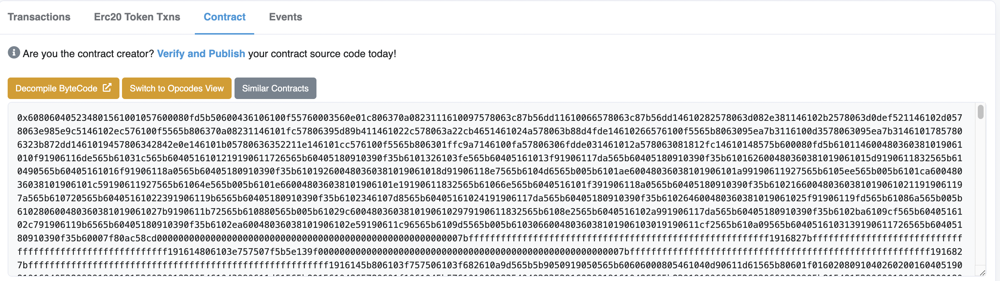
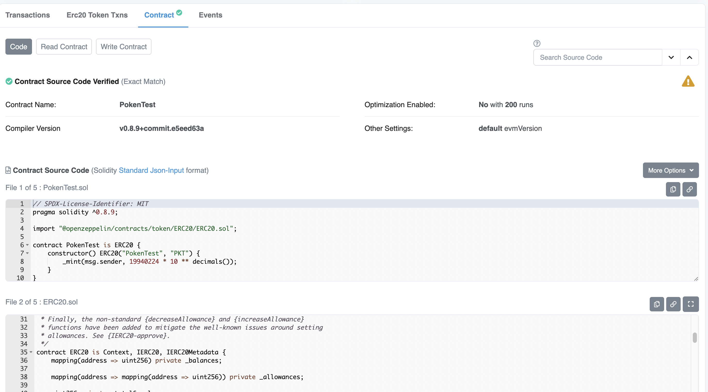
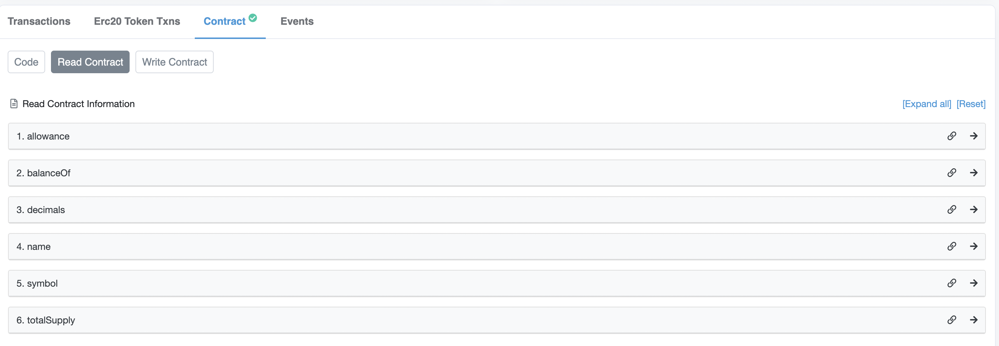
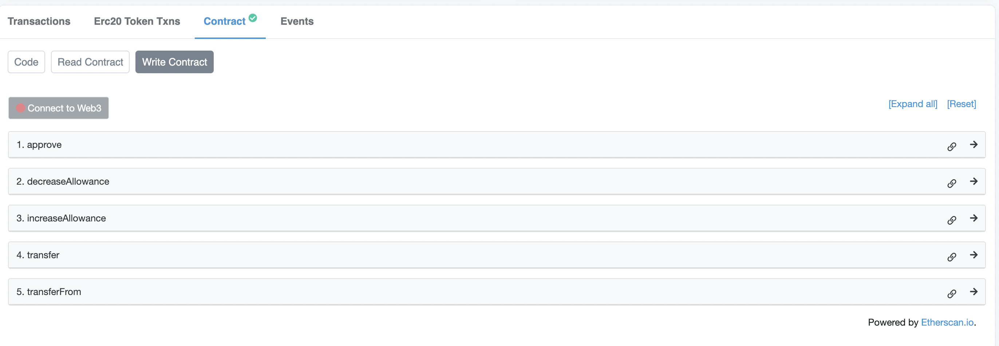
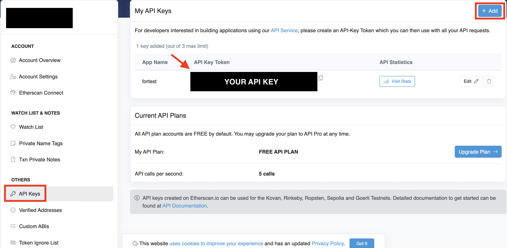
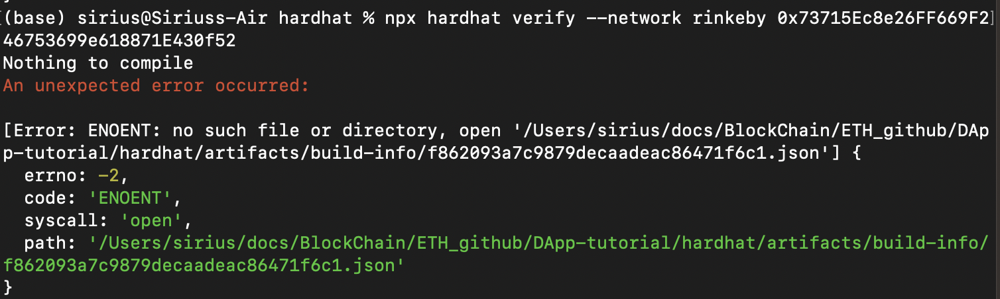
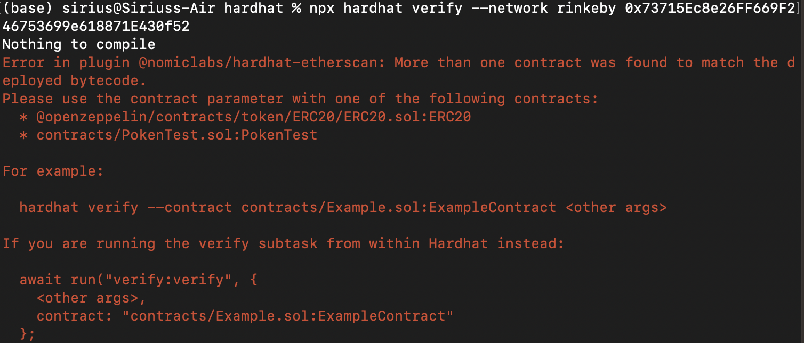
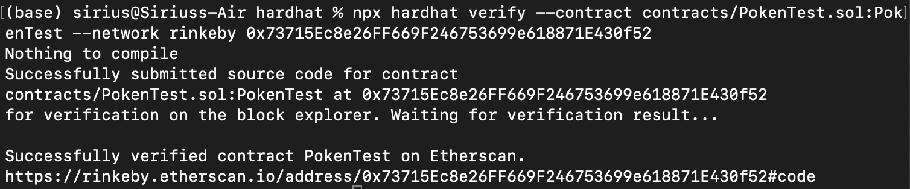
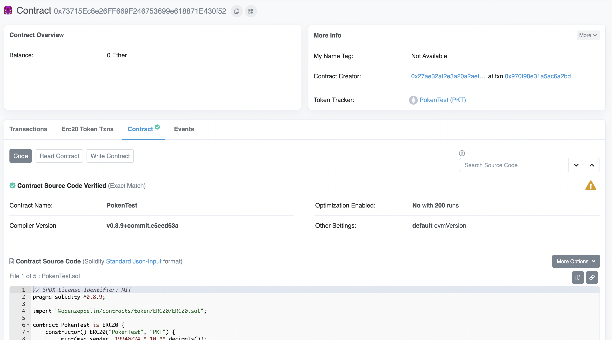
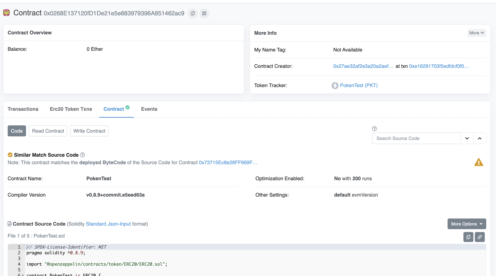

# Verify contract and Create Reveal NFT

參考資料：
1. [PecuLab Youtube Video (Verify)](https://youtu.be/4kCZ4OsZx9Q)
2. [PecuLab Youtube Video (Reveal)](https://youtu.be/3hMidO1TNT8)
3. [hardhat-etherscan](https://hardhat.org/hardhat-runner/plugins/nomiclabs-hardhat-etherscan)
4. [solidity_smart_contracts](https://github.com/HashLips/solidity_smart_contracts/blob/main/contracts/NFT/NFT_REVEAL.sol)

## Verify contract
* 驗證合約的重要性:合約部署之後，在Ethersacn上只會出現bytecode，而不會出現合約明碼（也就是我們寫的code)，在這樣的狀況下其他人無法閱讀我們的合約內容，也沒辦法得知實際上這個合約提供了哪些function可以使用。驗證完之後才會出現合約的明碼，也能看到有哪些function可以使用。透過這些驗證過的合約，我們可以去看合約的提供商是不是真的提供了他們宣告的功能，或者去比對合約的用處是否跟他們宣告的一樣，確認合約中提供的function和提供商說宣稱一致，才表示這個合約可信、可互動喔。

* 注意事項：通常deploy完之後要接著verify，如果deploy完又改了code，verify就不會成功或是有其他麻煩。這次我拿之前發PKT的合約來驗證，就有出現一些ERROR，下面會一起做紀錄

* bytecode!是什麼？像下面這張圖就是bytecode，看起來很像亂碼的東西，沒有驗證過的合約在etherscan上只能看到這個，也不能和合約做互動。[未驗證合約點這邊看](https://rinkeby.etherscan.io/address/0x72ba1ac155298a2bcbf41bba788e80426e23bf27#code)


* 合約驗證完之後會像下面這樣，除了可以看到合約的code，也可以直接在ethersacn上面做互動～[驗證過的合約點這邊看](https://rinkeby.etherscan.io/address/0x73715Ec8e26FF669F246753699e618871E430f52#code)





### STEP 1. Create & Set API key for etherscan
1. 先到[etherscan](https://etherscan.io/)註冊一個帳號，申請API

2. 在.env檔案中加入API，寫法像下面這樣
```
ETHERSCAN_API_KEY =  Your API key for Etherscan
```
3. 把API設定加入[hardhat.config.js](hardhat/hardhat.config.js)裡面
```
etherscan: {
    // Your API key for Etherscan
    // Obtain one at https://etherscan.io/
    apiKey: ETHERSCAN_API_KEY
  }
```
### STEP 2. Verify contract
* 參考[harhat教學](https://hardhat.org/hardhat-runner/plugins/nomiclabs-hardhat-etherscan)驗證合約有三個步驟
1. 安裝相關套件
```
npm install --save-dev @nomiclabs/hardhat-etherscan
```
2. 在[hardhat.config.js](hardhat/hardhat.config.js)加入設定
```
require("@nomiclabs/hardhat-etherscan");
```
3. 驗證合約 - `--network`後面設定測試鏈名稱或Ethereum主網(mainnet)
```
px hardhat verify --network rinkeby <<DEPLOYED_CONTRACT_ADDRESS>>
```
#### 然後我就Error了
1. 第一個Error碼是說找不到檔案，不知道是不是因為deploy完之後，因為又發了NFT的合約們，途中有什麼變動，導致找不到檔案，參考[這個](https://ethereum.stackexchange.com/questions/121176/error-when-trying-to-verify-contract)寫的解法，先clean之後再compile一次。

```
npx hardhat clean
npx hardhat compile
```
2. 第二個Error是說超過他找到超過一個和bytecode相符的合約，這應該是因為我deploy了不止一次造成的，參考錯誤碼中提供的解法，在指令中指定Verify哪一個合約`npx hardhat verify --contract <<合約所在的sol檔>>:<<sol檔中的合約名稱>>`

```
npx hardhat verify --contract contracts/PokenTest.sol:PokenTest --network rinkeby 0x73715Ec8e26FF669F246753699e618871E430f52
```
#### 然後就成功了！

回去Etherscan看，合約明碼就出現了喔！
- 這邊有一件事很有趣，進行驗證的合約地址是[0x73715Ec8e26FF669F246753699e618871E430f52](https://rinkeby.etherscan.io/address/0x73715Ec8e26FF669F246753699e618871E430f52#code)，但是當我點到另一份bytecode一樣但合約地址不同的那份合約([0x0268E137120fD1De21e5e883979396A851462ac9](https://rinkeby.etherscan.io/address/0x0268E137120fD1De21e5e883979396A851462ac9))，也一起得到驗證了，不確定是不是bytecode的會一起通過，希望有大神可以告訴我，哈哈～

- 我驗證的那份合約

- bytecode相同但沒有進行驗證的合約一起得到驗證了


## Create Reveal NFT
......待續