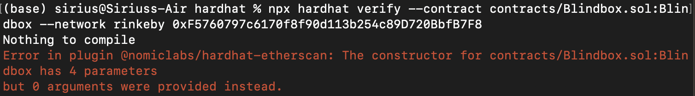

# Create a NFT_REVEAL contract

- 批次發行盲盒抽抽看！
- 盲盒分成兩個部分
    1. 第一個部分是先去讀懂參考資料2.中大神寫好的合約，看看基礎的盲盒需要那些功能，看懂了之後部署玩玩看
    2. 第二個部分是從合約裡面去改成盲盒中5種圖案隨機抽抽看！

參考資料：
1. [PecuLab Youtube Video](https://youtu.be/3hMidO1TNT8)
2. [solidity_smart_contracts](https://github.com/HashLips/solidity_smart_contracts/blob/main/contracts/NFT/NFT_REVEAL.sol)
3. [ERC721Enumerable](https://docs.openzeppelin.com/contracts/4.x/api/token/erc721#ERC721Enumerable)

## 盲盒合約閱讀及Deploy

### STEP 1. 合約
1. 合約直接從[solidity_smart_contracts](https://github.com/HashLips/solidity_smart_contracts/blob/main/contracts/NFT/NFT_REVEAL.sol)複製來的，詳細的註解直接看[合約](hardhat/contracts/Blindbox.sol)
2. 在reveal的地方加了一個判斷式，讓他可以是點了之後解盲，再點一次又可以變成盲盒，原先的設定是點了之後就不能再變回盲盒，但是每點一次都會被收gas，要注意測試幣夠不夠～
```javascript
function reveal() public onlyOwner {
      if (revealed==true) {
        revealed = false;
      }
      else
      {
        revealed = true;
      }   
  }
```

### STEP 2. deploy
1. 這個合約裡有4個留給時候才傳進去的參數，分別是_name、 _symbol、 _initBaseURI和_initNotRevealedUri，所以部署的檔案就不能完全抄以前的，要增加一些東西，這些參數如果直接寫在合約裡也可以。
```javascript
const hre = require("hardhat");

async function main() {
  // 去找出合約
  const BDB = await ethers.getContractFactory("Blindbox");
  // 把參數設定在這邊
  const _name = <<名稱>>;
  const _symbol = <<縮寫>>;
  // 解盲後的URL資料夾
  const _initBaseURI = <<URL>>;
  // 盲盒的URL
  const _initNotRevealedUri = <<URL>>;
  // deploy
  const bdb = await BDB.deploy(_name, _symbol, _initBaseURI, _initNotRevealedUri);
  await bdb.deployed();
  // 印出address
  console.log("bdb deployed to:", bdb.address);
}

// We recommend this pattern to be able to use async/await everywhere
// and properly handle errors.
main().catch((error) => {
  console.error(error);
  process.exitCode = 1;
});
```
2. 寫好之後就可以來deploy了！
```
npx hardhat clean
npx hardhat compile
npx hardhat run scripts/deploy_BDB.js --network rinkeby
```

### STEP 3. Verify
又會再度Error啦！coding就是在不斷的error中度過，哈哈哈！

這個錯誤是說我們在deploy的時候寫了下面4個參數，所以在驗證的時候也要把參數寫進去，然後我為了避免還有其他的問題，所以把要驗證的合約也一起加到指令裡面，verify的指令就變得很長ＸＤ
> const _name \
> const _symbol \
> const _initBaseURI \
> const _initNotRevealedUri 

```
npx hardhat verify --contract contracts/Blindbox.sol:Blindbox --network rinkeby 0xF5760797c6170f8f90d113b254c89D720BbfB7F8 "BlindBox" "BDB" "https://raw.githubusercontent.com/cherrytora/DApp-tutorial/main/blindBox/" "https://ipfs.io/ipfs/QmV8FTC94m9gpWzWPBETg8Fe614CjwPyUmx7txwfr6M3Xb?filename=blindBox.json"
```
這樣就成功啦！每次看到成功都覺得好～感動！


### STEP 4. opensea看看在部署合約的時候順便發給自己的盲盒
1. 首先是盲盒的樣子


2. 解盲的樣子（解盲到[Etherscan](https://rinkeby.etherscan.io/address/0xf5760797c6170f8f90d113b254c89d720bbfb7f8#readContract)上連結錢包，點reveal做喔！）


## 隨機盲盒抽抽看
- 接下來要挑戰隨機抽盲盒怎麼寫！錯誤一起記錄下來
- 寫隨機盲盒的時候發現[Remix](https://remix-project.org/)真是測試function的好東西！

### STEP 1. 寫一個Random function來生成隨機數列

參考下面教學們寫一個Random function，生成偽隨機數列(似乎在solidity無法生成真正的隨機數列？)
1. https://blog.csdn.net/meta_world/article/details/124418634
2. https://stackoverflow.com/questions/71425710/solidity-how-to-get-random-number-with-ratio
3. https://stackoverflow.com/questions/48848948/how-to-generate-a-random-number-in-solidity
4. https://blog.finxter.com/how-to-generate-random-numbers-in-solidity/

```javascript
function _getRandom(uint256 _start, uint256 _end) private view returns(uint256) {
      if(_start == _end){
          return _start;
      }
      uint256 _length = _end - _start;
      uint256 random = uint256(keccak256(abi.encodePacked(block.difficulty, block.timestamp, msg.sender)));
      random = random % _length + _start;
      return random;
  }
```

#### 瓶頸1 [BlindboxRan.sol](hardhat/contracts/BlindboxRan.sol)
本來很直覺的想說把Random加在tokenURI中，讓他自動去更新tokenURI就好了，然後我就碰到瓶頸了！哈哈哈哈
解盲之後查詢tokenURI的確是每個tokenID會對應到隨機的URI，但是每查詢一次相同的tokenURI，就會再random分配一次URI！！也許應該再建立一個function去把tokenID對應的URL收起來？
```javascript
function tokenURI(uint256 tokenId)
    public
    view
    virtual
    override
    returns (string memory)
  {
    require(
      _exists(tokenId),
      "ERC721Metadata: URI query for nonexistent token"
    );
    
    if(revealed == false) {
        return notRevealedUri;
    }

    // 隨機生成1~5 return一個Random的URI
    uint256 BDnum = _getRandom(1,6);
    string memory currentBaseURI = _baseURI();
    return bytes(currentBaseURI).length > 0
        ? string(abi.encodePacked(currentBaseURI, BDnum.toString(), baseExtension))
        : "";
  }

```

### STEP 2. 建立一個把URI收起來的function
```javascript
// 每一個tokenId對應產生一個隨機的URL(1~5)，裝到_tokenURIs這個dic裡面
mapping(uint256 => string) private _tokenURIs; 

  function _Id_Urls(uint256 tokenId) internal virtual {
      require(
          _exists(tokenId),
          "ERC721Metadata: URI set of nonexistent token"
      );  // Checks if the tokenId exists
      uint256 BDnum = _getRandom(1,6);
      string memory currentBaseURI = _baseURI();
      _tokenURIs[tokenId] = string(abi.encodePacked(currentBaseURI, BDnum.toString(), baseExtension));
  }
```

### STEP 3. 把 _Id_Urls加到mint
mint產生tokenID的時候就分配一個隨機的Url給每個tokenID
```javascript
function mint(address _to, uint256 _mintAmount) public payable {
    uint256 supply = totalSupply();
    require(!paused);
    require(_mintAmount > 0);
    require(_mintAmount <= maxMintAmount);
    require(supply + _mintAmount <= maxSupply);
     
    if (msg.sender != owner()) {
        if(whitelisted[msg.sender] != true) {
          require(msg.value >= cost * _mintAmount);
        }
    }

    for (uint256 i = 1; i <= _mintAmount; i++) {
      _safeMint(_to, supply + i);
      _Id_Urls(supply + i); // 每個tokenID都分配一個URI
    }
  }
```

#### 瓶頸2 [BlindboxRan2.sol](hardhat/contracts/BlindboxRan2.sol)
這樣看似完成了，但deploy合約之後發現每一批mint的token都會是相同的URI!一開始以為迴圈沒有跑進去，但對照tokenID確定不是迴圈的問題，那會是什麼問題呢？在重新檢視了很多次之後終於找到了，問題出現在_getRandom！我的_getRandom是這樣寫的
```javascript
random = uint256(keccak256(abi.encodePacked(block.difficulty, block.timestamp, msg.sender)))
```

但是每一批mint的這三個數值會一樣block.difficulty, block.timestamp, msg.sender，導致每一批的URI都是相同的，所以我建立一個_rand，把msg.sender這個參數換成_rand，_getRandom改寫成這樣
```javascript
uint private _rand = 3; // 設定隨機種子

//  生成偽隨機數列(似乎無法生成真正的隨機數列？)
  function _getRandom(uint256 _start, uint256 _end) private returns(uint256) {
      if(_start == _end){
          return _start;
      }
      uint256 _length = _end - _start;
      uint256 random = uint256(keccak256(abi.encodePacked(block.difficulty, block.timestamp, _rand)));
      random = random % _length + _start;
      _rand++;
      return random;
  }
```

改完後用[Remix](https://remix.ethereum.org/?#code=Ly8gU1BEWC1MaWNlbnNlLUlkZW50aWZpZXI6IE1JVApwcmFnbWEgc29saWRpdHkgXjAuOC40OwoKaW1wb3J0ICJAb3BlbnplcHBlbGluL2NvbnRyYWN0c0A0LjcuMi90b2tlbi9FUkMyMC9FUkMyMC5zb2wiOwoKY29udHJhY3QgUG9rZW4yIGlzIEVSQzIwIHsKICAgIGNvbnN0cnVjdG9yKCkgRVJDMjAoIlBva2VuMiIsICJQTzIiKSB7CiAgICAgICAgX21pbnQobXNnLnNlbmRlciwgMTk5NDkyMjQgKiAxMCAqKiBkZWNpbWFscygpKTsKICAgIH0KfQo&optimize=false&runs=200&evmVersion=null&version=soljson-v0.8.17+commit.8df45f5f.js)測試就發現成功了！同一批mint的盲盒在解盲後會有不同的URI了!
成功的程式碼放在[這邊](hardhat/contracts/BlindboxRan3.sol)~

#### BlindboxRanS on etherscan
這三個版本的合約etherscan的連結在下面，有興趣的人可以玩玩看哈哈～ \
> [BlindboxRan on etherscan](https://rinkeby.etherscan.io/address/0x5B7EA69BD08dC8553e952F7208d9bCEEBd584d13#readContract) \
> [BlindboxRan2 on etherscan](https://rinkeby.etherscan.io/address/0x68829610899a470298ac0365a2432C7428C9c0CB#readContract) \
> [BlindboxRan3 on etherscan](https://rinkeby.etherscan.io/token/0x10fd73a7557b399a4937e379FF70d75bB854685c#readContract)

Back to [README](README.md)