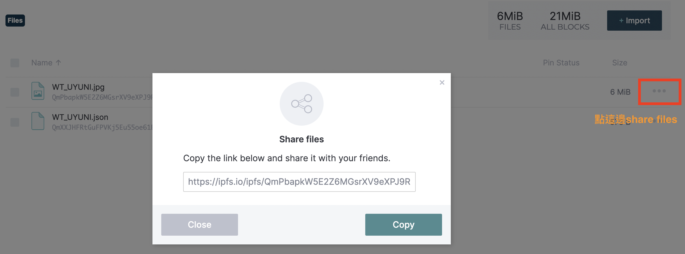
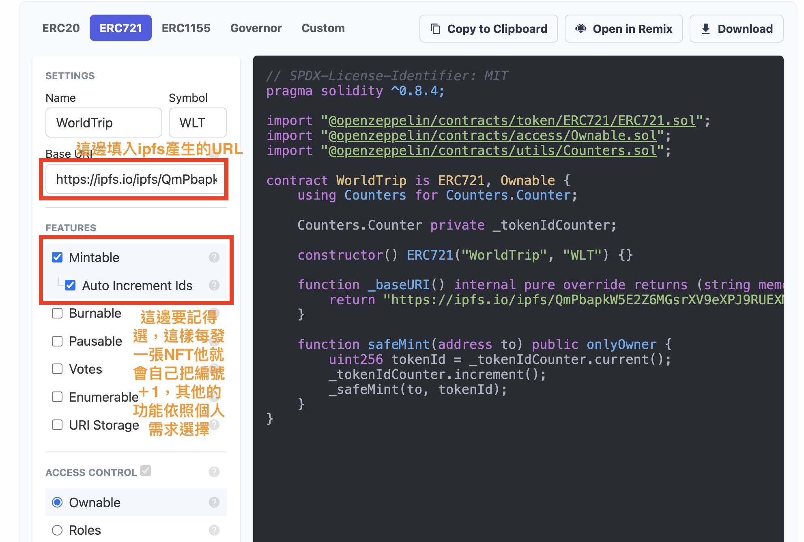
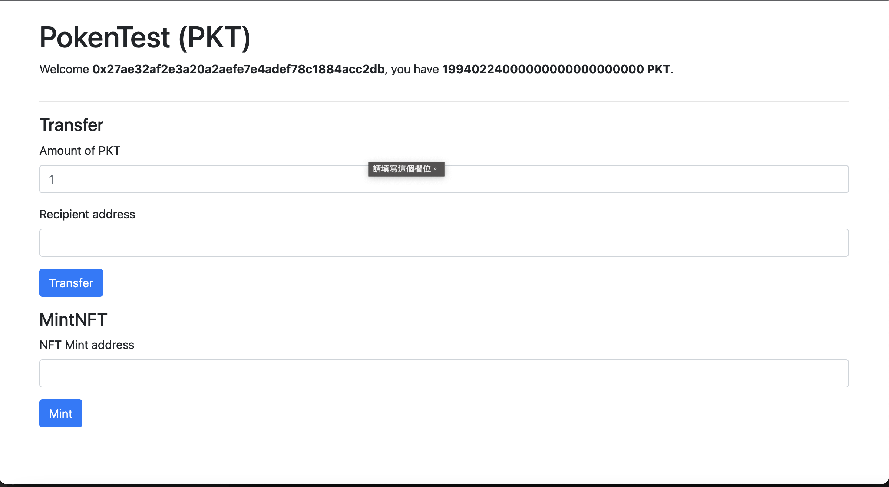
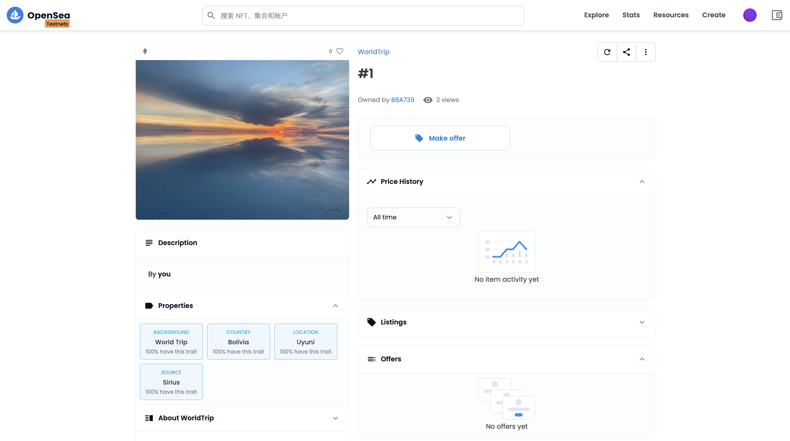

# Create NFT

參考資料：
1. [PecuLab共學Youtube](https://youtu.be/StJ_gqnb-ms)
2. [PecuLab Github](https://github.com/pecu/PecuLab4SEP)
3. [ipfs docs](https://docs.ipfs.tech/)


## 前置作業
### ipfs 介紹
1.什麼是ipfs? 
> ipfs 的全名是 InterPlanetary File System。簡單的說，ipfs會像git一樣，為每個檔案建立一個hash值，不會有兩個檔案有相Hash值的情況，有點像人類的指紋一樣，每個人的指紋都不同，如果要辨識這個人的身份，可以從指紋去辨識。ipfs有點類似這樣在運作，在找尋檔案的時候，是透過hash值去找的，而不是傳統的http位址。ipfs並不是一種區塊鏈技術，但他的宗旨是要和區塊鏈結合協同運作。
詳細的內容可以參考：[IPFS 分散式檔案系統](https://www.samsonhoi.com/689/blockchain-ipfs-intro) 和 [入門淺談：什麼是 IPFS？](https://blockcast.it/2019/10/16/let-me-tell-you-what-is-ipfs/)喔！

2. 有ipfs的概念之後，就可以開始來實作啦！首先要去[ipfs](https://ipfs.tech/)下載desktop版
3. 先把想做成NFT的檔案上傳，這邊要注意，上傳之後這張圖片就會被賦予一個hash值，所以如果上傳後想要再作修改hash值也會改變，相對應的code都需要調整，所以建議確定好再上傳！然後複製URL
4. 上傳一個json檔，裡面要寫好剛剛傳到ipfs的URL和一些形容這個NFT的屬性，大概像這樣子
```json
{ 
    "image":"ipfs URL",
    "attributes": // trait_type和value都可以自己定義
        [
            {
                "trait_type":"background", 
                "value":"World Trip"
            },
            {
                "trait_type":"location",
                "value":"Uyuni"
            },
            {
                "trait_type":"country",
                "value":"Bolivia"

            },
            {
                "trait_type":"source",
                "value":"Sirius"
            }
            
        ]
}
```

### deploy NFT

部署NFT和token的過程是一樣的
1. 去openzeppelin做一個基礎版的合約，這邊跟token不一樣的是要選擇721，選好後下載放到`hardhat/contracts`

* 這邊要注意，填入合約個URL是json的URL喔！不是照片的URL
2. 建立 test 和deploy檔案，進行compile和test

```
npx hardhat compile
npx hardhat test
``` 
* 如果想要只執行test資料夾裡面的一個檔案，可以這樣下指令
```
npx hardhat test test/Test_WT.js
npx hardhat test <folder>/<file name>.js
```
3. 都沒問題後就可以deploy，拿到address
```
npx hardhat run scripts/deploy_WT.js --network rinkeby
```

### Mint & 加入 DApp

deploy完之後要接著Mint和加入我們的DApp

#### 新增Mint.js檔案
* 在`components`資料夾中新增Mnit.js檔，用來進行Mint剛剛deploy的NFT。Mint的過程和Transfer很類似，可以複製Transfer的檔案來改就好。細節記錄在[Mint.js](hardhat/frontend/src/components/Mint.js)中

#### 在[dapp.js](hardhat/frontend/src/components/Dapp.js)中，加入我們要Mint的步驟。
1. 在contract_address檔案中加入剛剛deploy的NFT address
2. 在import的地方加入 import compile NFT合約後產生的json檔
```javascript
import WTnft from "../contract/WorldTrip.json";
```
3. import 剛剛建好的Mint.js
```javascript
import { MintNFT } from "./Mint";
```
4. 在 async _initializeEthers() 中加入我們的NFT
```javascript
async _initializeEthers() {
    // We first initialize ethers by creating a provider using window.ethereum
    this._provider = new ethers.providers.Web3Provider(window.ethereum);

    // Then, we initialize the contract using that provider and the token's
    // artifact. You can do this same thing with your contracts.
    this._token = new ethers.Contract(
      contract_address.PokenTest,
      PokenCoin.abi,
      this._provider.getSigner(0)
    );
    //  initialize the NFT artifact
    this._nft = new ethers.Contract(
      contract_address.WorldTrip,
      WTnft.abi,
      this._provider.getSigner(0)
    );

    }
```
5. 在_transferTokens下面，加入_mintNFT function，transferTokens和mintNFT的過程很像，可以複製_transferTokens的來改。
```javascript
async _mintNFT(to) {
    try {      
      this._dismissTransactionError();
      // 這邊的this._nft就是上面initial的東西
      // safeMint則是回去看合約裡的function是什麼
      const tx = await this._nft.safeMint(to); 

      // 其他部分都跟transferTokens一樣
      this.setState({ txBeingSent: tx.hash });

      const receipt = await tx.wait();

      
      if (receipt.status === 0) {
        throw new Error("Mint failed");
      }
    } catch (error) {
      if (error.code === ERROR_CODE_TX_REJECTED_BY_USER) {
        return;
      }
      console.error(error);
      this.setState({ transactionError: error });
    } finally {
      this.setState({ txBeingSent: undefined });
    }
  }
```

6. 加入下面的程式碼，讓Dapp去調用MintNFT中取addree的部分，並傳到上面的this._mintNFT裡面
```javascript
{
    <MintNFT
    mintNFT={(to) =>
    this._mintNFT(to)
    }
    />
            }
```
7. 都好了之後，`npm start`之後就會看到NFT加在原先的token下面啦



8. 可以把NFT轉給自己，去[opensea testnet](https://testnets.opensea.io/zh-CN)連結錢包就看得到囉！



9. 地雷！NFT的ID似乎應該要從1開始，而不是0，[參考自](https://ethereum.stackexchange.com/questions/126737/token-id-0-minted-error)。所以我mint的時候ID = 0的那一張NFT無法顯示，所以程式碼要從
```s
constructor() ERC721("WorldTrip", "WLT") {}
```
改成
```s
constructor() ERC721("WorldTrip", "WLT") { _tokenIdCounter.increment(); }
```

 

