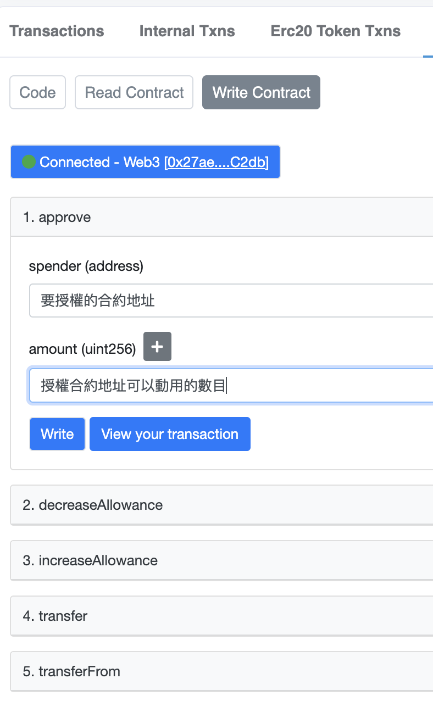
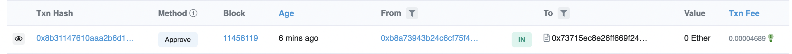
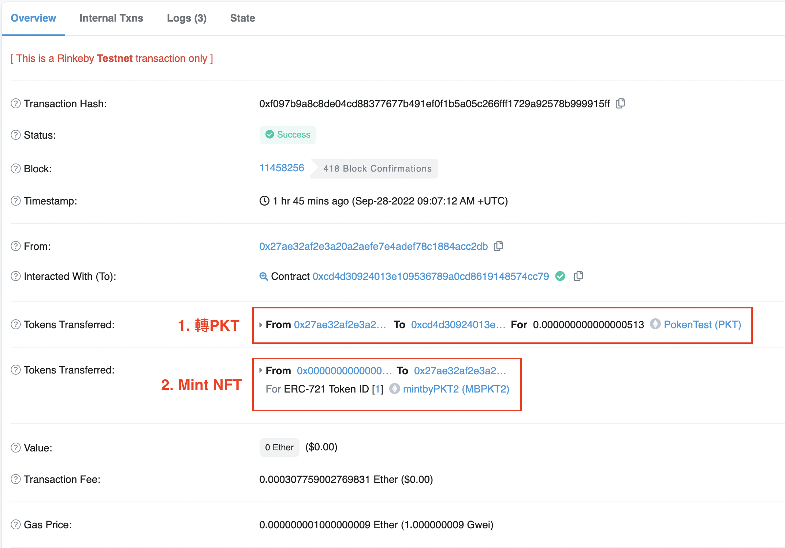

# Mint NFT by My own ERC20 token 

參考資料：
1. [Youtube video](https://www.youtube.com/watch?v=dbsmJ-fbgxQ) ＆ [Github](https://gist.github.com/shobhitic/9e1e8b9c274088a993c254ef2cfb9cb7)
2. [ethereum.stackexchange 1](https://ethereum.stackexchange.com/questions/120194/erc721-nft-minting-to-accept-custom-erc20-token-as-payment)
3. [ethereum.stackexchange 2](https://ethereum.stackexchange.com/questions/114572/how-to-mint-your-own-erc721-with-your-own-erc20-token)
4. [ERC20 Token使用手冊](https://medium.com/taipei-ethereum-meetup/erc20-token%E4%BD%BF%E7%94%A8%E6%89%8B%E5%86%8A-3d7871c58bea)
5. [ERC20 - Approve & TransferFrom not working](https://ethereum.stackexchange.com/questions/73714/erc20-approve-transferfrom-not-working)
6. [call the erc20 approve function from another](https://forum.openzeppelin.com/t/is-it-possible-to-call-the-erc20-approve-function-from-another-contract/2758)
7. [Approve ERC20 token inside a contract function](https://ethereum.stackexchange.com/questions/112644/approve-erc20-token-inside-a-contract-function)


## Steps
1. 把自己發的token接到合約裡面
2. mint前確認PKT額度和轉PKT到合約中，結束後才把nft mint出去
3. 一樣要寫一個withdraw，但這邊要提的錢不是Ether，而是PKT
4. 到自己的token那邊把授權合約可以從別人那邊提領PKT（transferFrom功能）

完整的code到[這邊]()看喔！


### Step 1. 把自己發的token接到合約裡面
```javascript
// 在最上面的地方import PKT 的合約
import './PokenTest.sol';
// 設定一個盲盒的價錢
uint256 public price = 513;
/*
這邊忘記做單位轉換
所以在交易裡看到的只有0.000000000000000513 PKT
應該要寫513 * 10 ** 18才是513顆PKT
*/

// 在contract裡面調用PKT
 PokenTest public PKT;

// constructor裡把PKT接過來用
PKT = PokenTest(0x73715Ec8e26FF669F246753699e618871E430f52);
```

### Step 2. mint前確認PKT額度和轉PKT
```javascript
// in mint function
// 確認PKT額度，可以動用的PKT額度要大於或等於price * _mintAmounth才繼續進行下去
require(PKT.allowance(msg.sender, address(this)) >= price * _mintAmount, "Not enough of PKT");

// 把PKT從msg.sender轉到這個合約裡
PKT.transferFrom(msg.sender, address(this), price * _mintAmount);
```

### Step 3. 最後寫一個withdraw，讓token可以從合約中提領到我們的錢包
```javascript
function withdrawToken() public onlyowner{
    PKT.transfer(msg.sender, PKT.balanceOf(address(this)));
}
```
後面的deploy和verify和前面都一樣，就不再重寫一次了


### Step 4. deploy完合約之後記得去PKT那邊授權合約地址可以從別人那裡把PKT轉給自己
1. 到etherscan上進行[PKT](https://rinkeby.etherscan.io/address/0x73715Ec8e26FF669F246753699e618871E430f52#writeContract)授權


2. 確定授權完成


3. 回到[合約](https://rinkeby.etherscan.io/address/0xCd4D30924013E109536789a0CD8619148574Cc79#writeContract)去買一個NFT，交易完成之後可以看到合約進行了兩個交易，分別是把PKT轉到合約中，和Mint一個NFT出去



#### 小知識：approve和transferFrom是一對的，transferFrom前一定要先approve！
```javascript
// 允許_spender可以把錢提走（執行transferFrom）
PKT.approve(address _spender, uint256 value);
// 會return uint265，查詢owner讓spender可以提多少錢走
PKT.allowance(address _owner, address _spender);
// 把value顆的token從owner轉到spender
PKT.transferFrom(address _owner, address _spender, uint value);
```

##### 小瓶頸：
一開始我把approve寫在合約裡但怎麼樣都不會作用，後來才發現合約本身不能授權自己之後把token轉給自己，這應該算是一個安全機制，所以我們用自己的token買NFT的時候，必須要先去[token](https://rinkeby.etherscan.io/address/0x73715Ec8e26FF669F246753699e618871E430f52#code)那邊授權給合約，合約裡的transferFrom才可以作用，或是要再寫一個合約去approve也可以，這部分就等到做side project的時候再去跟DApp結合啦！


Back to [README](README.md)
