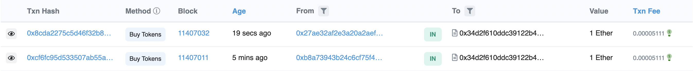
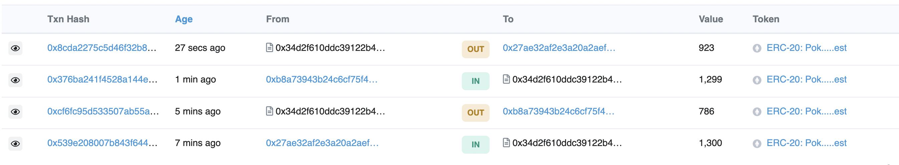

# Create a mystery drop contract

- 這個合約要做的是每一次買可以得到不一定個數的token!
- 有點像盲盒，但是少了開盒的動作～

參考資料：
1. [實踐一個簡單的盲盒合約](https://blog.csdn.net/meta_world/article/details/124418634)
2. [Vendor.sol](hardhat/contracts/vendor.sol)

因為實在找不到範例，先把想法寫下來：
1. 可以用vendor合約去改，只要加上一個random，mint的時候每次隨機分發PKT個數也許可行？
2. 一樣把withdraw留下來，讓owner可以把Ether領出來

```javascript
// 加上一個random function
  function _getRandom(uint256 _start, uint256 _end) private returns(uint256) {
      if(_start == _end){
          return _start;
      }
      uint256 _length = _end - _start;
      uint256 random = uint256(keccak256(abi.encodePacked(block.difficulty, block.timestamp, _rand)));
      random = random % _length + _start;
      _rand++;
      return random;
  }
```

```javascript
// 一個Ether可以買幾個我們發的token
    uint256 tokensPerEth = _getRandom(500,1000);
```

其他部分基本上就跟[vendor.sol](hardhat/contracts/vendor.sol)相同，完整的code在[這裡](hardhat/contracts/RandomPKT.sol)

在etherscan上可以看到同樣是1 ether的交易，得到不同數量的PKT! 沒想到這樣就成功了，還以為會碰到什麼未知的瓶頸ＸＤ
 



- 小小的錯誤：第一次deploy的時候發現忘記要把[RandomPKT](https://rinkeby.etherscan.io/address/0xD75805557a505A3bBa1bCfD6737Ab8E90bac1d36#code)中的tokensPerEth的public拿掉，所以tokensPerEth的數字會出現在ReadContract上，但這樣就沒有驚喜了，修正後[RandomPKT2](https://rinkeby.etherscan.io/address/0x34d2F610dDC39122B467A8F7f929728597587e91#code)再重新deploy一次！ 
